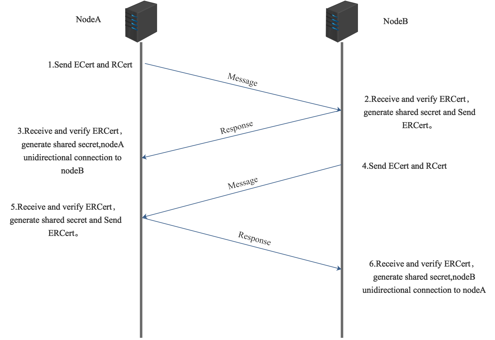
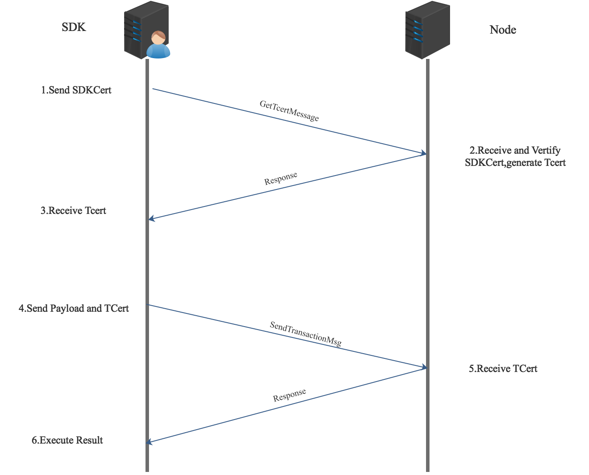

## Digital Certificate

### 1.Overview

Hyperchain is a consortium blockchain service platform with granular granularity of permission control.It requires multi-level CA certificates for permission control. Access control is divided into two aspects:

- Node access control
- Trading authority control

First of all, we need to know is that the permissions control is the Namespace level, that is, each Namespace will have a corresponding CaManager for CA certificate management and Namespace level permission control. The following is our PKI system (certificate system) map:


- root.ca (root certification authority): It represents the trust anchor in the PKI architecture. Verification of digital certificates follows the chain of trust. The root CA is the top-level CA in the PKI hierarchy and is used to issue enrollment certificate authorities and role certificate authorities.
- eca.ca (enrollment certificate authority): Used to issue nodes node Enrollment certificates (ecert) and sdk certificates (sdkcert).
- rca.ca (role certificate authority): Used to issue a role certificate (rcert) to a node.
- ecert.cert (enrollment certificate): An enrollment certificate is a long-term certificate issued to a node for access to the node. If no enrollment certificate is available, the node can not join the Namespace and the enrollment certificate is also used as a transaction The issuer of the certificate is used to issue the transaction certificate.
- rcert.cert (role certificate): A role certificate is a long-term certificate that is issued to a node for authentication of the role of the node. If there is no role certificate, this node is an NVP and can not participate in the consensus. Otherwise, it is a VP node.
- sdkcert.cert (sdk certificate): The SDK certificate is issued to the SDK to determine the basis of the (Tcert) used to authenticate the SDK and obtain the transaction certificate when receiving the SDK certificate.
- tcert.cert (transaction certificate): The SDK needs to send the transaction with the transaction certificate. If there is no transaction certificate or the certificate verification fails, the transaction is abandoned.

### 2.Certificate Introduction

Hyperchian blockchain platform certificates are in line with ITU-T X.509 international standards, it only contains the public key information without private key information, is publicly available, so X.509 certificate object generally do not need to be encrypted. The format of the X.509 certificate is usually as follows:

    ---BEGIN CERTIFICATE---
    ……PEM encoded X.509 certificate content (omitted)……
    ---END CERTIFICATE---

The full name of PEM encoding is Privacy Enhanced Mail, which is a coding standard for confidential email. In general, the process of encoding information is basically as follows：

- The information is converted to ASCII or other encoding, such as using DER encoding.
- Use symmetric encryption algorithm to encrypt the encoded information.
- Use BASE64 to encode the encrypted information.
- The use of some header definitions to encapsulate the information, mainly contains the necessary information for the correct decoding.

In addition, the Hyperchain blockchain platform certificate specifically includes the following information:

1. X.509 version number: Pointed out that the certificate which version of the X.509 standard version number will affect some specific information in the certificate. The current version is 3.

2. Certificate holder's public key: includes the certificate holder's public key, the identifier of the algorithm (indicating which cryptographic system the key belongs to) and other relevant key parameters.
3. the serial number of the certificate: given by the CA assigned to each certificate a unique number, when the certificate is canceled, the certificate is actually the serial number of the certificate issued by the CA CRL (Certificate Revocation List certificate revocation list, Or certificate black list). This is also the only reason for the serial number.
4. Topic information: The unique identifier of the certificate holder (or DN-distinguished name) This name should be unique on the Internet. The DN consists of many parts that look like this:

```
CN=Bob Allen, OU=Total Network Security Division
O=Network Associates, Inc.
C=US
```

​	The information indicates the common name of the subject, the name of the organizational unit,					               organization and country or certificate holder, and the location of the service.						

5. the validity of the certificate: the certificate start date and time and the date and time of termination; specified certificate valid for these two periods.
6. Certification body: The certificate issuer, which is the X.509 name of the only CA that issued the certificate. Using this certificate means trusting the entity that issued the certificate. (Note: In some cases, such as a root or top-level CA certificate, the publisher itself issues a certificate)
7. Digital signature of the publisher: This is a signature generated using the publisher's private key to ensure that the certificate has not been redirected since it was released.
8. Signature algorithm identifier: used to specify the signature algorithm used by the CA to sign the certificate. The algorithm identifier is used to specify the public key algorithm and hash algorithm used by the CA when issuing a certificate.

### 3.CA Configuration

CA configuration required in the namespace.toml configuration file, the specific parameters are as follows:

``` 
[encryption]
[encryption.ecert]
 eca    = "config/certs/eca.cert"
 ecert  = "config/certs/ecert.cert"
 priv   = "config/certs/ecert.priv"

[encryption.rcert]
 #if you do not have rcert, leave this item blank
 rca    = "config/certs/rca.cert"
 rcert  = "config/certs/rcert.cert"
 priv   = "config/certs/rcert.priv"

[encryption.tcert]
 #Tcert whitelist configuration.
 whiteList = false
 listDir  = "config/certs/tcerts"

[encryption.check]
 enable     = true  #enable ERCert
 enableT    = false  #enable TCert
```

First of all, the first six parameters are related to the configuration change Namespace certificate path, namely eca, ecert and ecert corresponding private key, rcar, rcert and rcert corresponding private key.

And the TCert configuration, the platform supports the TCert whitelist policy, that is, when the ```whiteList = true```, the TCert whitelist policy is enabled, and the TCert certificate under the listDir parameter configuration is an immediately available transaction certificate. On the other hand, when the ```whiteList``` is false, the whitelist policy is not enabled. Only when the validity of the transaction certificate is verified and the transaction certificate is determined to be the node and the transaction certificate promulgated under the Namespace can the verification be fully verified.

The last two parameters are configured switch parameters, ```enable``` is  used to open the enrollment certificate and the role of the certificate check switch. ```EnableT``` is uesd to open the transaction certificate verification switch configuration, only when the parameter is set to true Before the transaction certificate verification. The dynamic switch configuration also makes the block chain more flexible.

### 4.Certificate acquisition and verification process

#### 4.1 ECert and RCert

##### 4.1.1 Acquisition

Enrollment certificates and role certificates are mainly issued under the control of the line, a Certgen certificate issuance tool for certificate generation.	

##### 4.1.2 Verification

If the ECert and RCert check switches are turned on, the specific verification flow is as follows:



ECert and RCert exchanged certificates and authenticated the certificate when the node handshake the connection for the first time to determine whether the node is allowed to enter the chain and the role information of the connected node.

#### 4.2 TCert

TCert acquisition and verification of the flow chart as shown below:



##### 4.2.1 Acquisition

First, the SDK or the external application needs to send a GetTcert message to the connected node. The message needs to carry the SDKCert to authenticate the SDK or the external application. After the authentication is passed, the TCert certificate is generated and promulgated.

##### 4.2.2 Verification

If the SDK or the external application acquires the TCert successfully, the following transaction needs to carry the relevant transaction certificate to the relevant node for verification. Only after the transaction certificate is verified, the next transaction execution will be performed.


