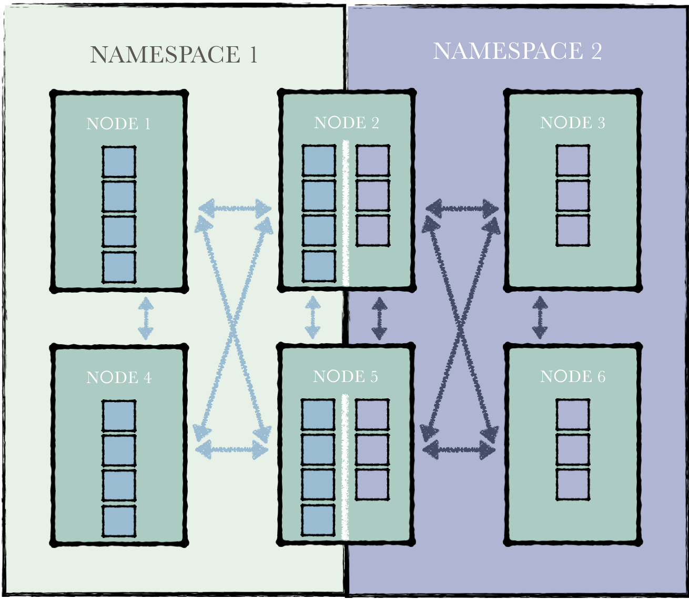
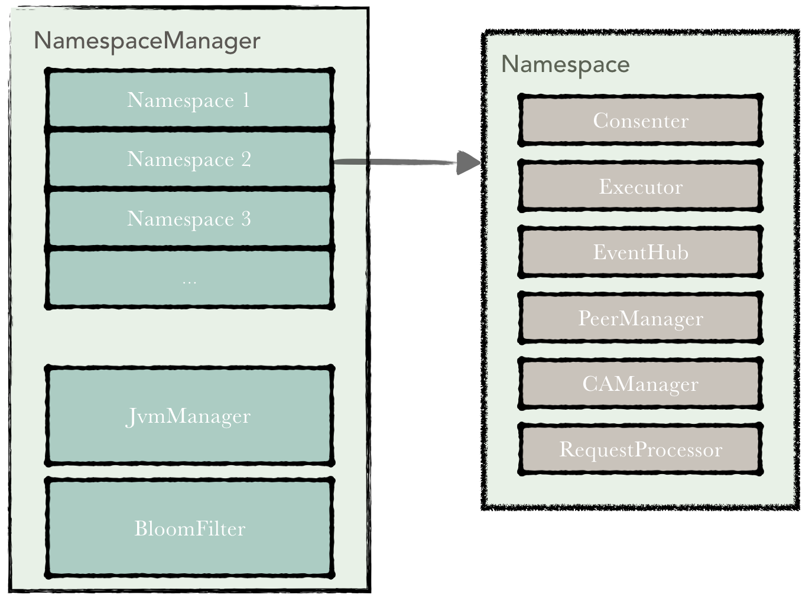

# Namespace

## 1.Overview

Hyperchain achieves a partitioned consensus on internal transactions in blockchain network  by the Namespace mechanism. Users of the Hyperchain platform can differentiate business transactions by namespace. Nodes in the same Hyperchain consortium blockchain network form sub-blockchain networks in namespace-size based on the services they participate in. Namespaces achieve business-level privacy protection through physical level isolation of business transaction consensus, distribution and storage .

## 2.Cluster Architecture

Namespaces can be dynamically created, and individual Hyperchain nodes can participate in one or more namespaces according to their business needs. The following figure shows the overall cluster architecture of the namespace mechanism: six nodes participate in two namespaces. Node1, node2, node4 and node5 form namespace1, and node2, node3, node5 and node6 form namespace2. Node1 and node4 only participate in namespace1, node3 and node6 only participate in namespace2, while node2 and node4 participate in two namespaces at the same time. The namespace controls the dynamic joining and exiting of nodes through CA authentication, and each node is allowed to participate in one or more namesapces.

The verification, consensus, storage and transmission of transactions with specific namespace information are performed only among nodes that participate in the corresponding namespace. Transactions between different namespaces can be executed in parallel. As shown in the following figure, Node1 can only participate in the verification of the transactions in namespace1 and the corresponding ledger maintenance. Node2 can simultaneously participate in transaction execution and account maintenance of namespace1 and namespace2. However, the ledgers of namespace1 and namespace2 in node2 are not accessible to each other.

## 3.Node Architecture

`Hyperchain`'s single node with the partition consensus mechanism will include a  `NamespaceManager` object. `NamespaceManager` is the key management component of the partition consensus mechanism, which is responsible for a series of life-cycle state operations such as registering, starting, stopping and de-registering a specific namespace.

`NamespaceManager` contains multiple namespaces, in addition to JvmManager and BloomFilter.

In particular：

- `JvmManager`  is responsible for managing the jvm executor, and starting JvmManager or not should be configured in the configuration file;
- `BloomFilter` is a bloomFilter for transactions, which is mainly responsible for detecting duplicate transactions and preventing replay attacks.

One of the partitions is called a `namespace`, and each namespace is isolated from each other, including the execution space and data storage space. Each node joins the namespace named global by default. Each `namespace` contains key components such as `consenter`, `executor`, `eventHub`, `peerManager`, `caManager`, `requestProcessor`, etc.. And these key components implement consensus service, transaction execution and storage, asynchronous interaction among modules, inter-node communication, identity authentication, transaction processing for the respective namespace blockchain.

To be specific:

- `consenter` provides consensus services and currently supports the RBFT algorithm, which is responsible for sequencing the transactions to ensure the consistency of the hyperchain nodes in the same namespace;
- `executor` is responsible for the invocation of the smart contract in the namespace and the maintenance of the ledger;
- `eventHub` is an event bus, which is a message transit center for asynchronous interaction between various key components in the namespace;
- `peerManager` provides node communication management, is responsible for network communication between namespace members;
- `caManager` is a certificate authority, which is responsible for the identity authentication on the Internet;
- `requestProcessor` is a request processing component, which is responsible for processing JSON-RPC messages and eventually invokes the corresponding api via reflection.

## 4.Transaction Flow

After the introduction of namespace, hyperchain node's transaction execution flow has been changed. The client can send the transaction to the corresponding namespace. After the transaction is passed to the hyperchain platform, the json rpc service will first conduct preliminary work on parameter checking and signature verifying. After that, the json rpc service forwards the request to the NamespaceManager. The NamespaceManager will send the transaction to the specific namespace according to the namespace field in the request. Transactions between different namespaces can execute concurrently. The corresponding namespace will call requestProcessor to process transactions, and firstly check the parameters of the request. If there is no problem, the corresponding processing function is called by reflection and the result could be returned.

