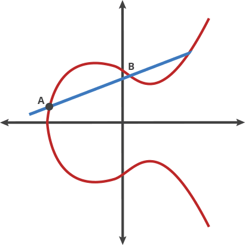

## 密码学算法

### 1.概述

Hyperchain区块链平台支持多级密码学加密来保证数据安全，利用了以下密码学算法来保证了数据的安全性问题：

- 椭圆曲线数字签名:secp256k1,secp256r1
- 对称加密算法:3DES,AES
- 密钥交换:ECDH
- 密码杂凑:Keccak-256

### 2. 椭圆曲线数字签名

椭圆曲线数字签名算法（ECDSA）是使用[椭圆曲线密码（ECC）对数字签名算法（DSA）的模拟。ECDSA于1999年成为ANSI标准，并于2000年成为IEEE和NIST标准。它在1998年既已为ISO所接受，并且包含它的其他一些标准亦在ISO的考虑之中。与普通的离散对数问题（discrete logarithm problem  DLP）和大数分解问题（integer factorization problem  IFP）不同，椭圆曲线离散对数问题（elliptic curve discrete logarithm problem  ECDLP）没有亚指数时间的解决方法。因此椭圆曲线密码的单位比特强度要高于其他公钥体制。椭圆曲线的图形如下图所示：



Hyperchain区块链使用了secp256k1曲线对平台交易进行签名验签，保证交易的正确性以及完整性。同时平台支持利用secp256r1曲线对节点间消息进行签名验证，保证节点间消息通信的完整性以及正确性。节点消息签名可插拔，可以通过配置文件开启，配置文件在namespace.toml下：

```
[encryption.check]
sign = true  #enable Signature
```

即当`sign=true`时，需要进行节点间消息的签名验证，反之则无需验证。

### 3.对称加密算法

Hyperchain区块链平台同时支持AES，3DES的对称加密算法，保证节点间的密文传输。

3DES又称Triple DES，是DES加密算法的一种模式，它使用3条56位的密钥对3DES数据进行三次加密。数据加密标准（DES）是美国的一种由来已久的加密标准，它使用对称密钥加密法.DES使用56位密钥和密码块的方法，而在密码块的方法中，文本被分成64位大小的文本块然后再进行加密。比起最初的DES，3DES更为安全。加密算法，其具体实现如下：设Ek()和Dk()代表DES算法的加密和解密过程，K代表DES算法使用的密钥，M代表明文，C代表密文，这样：

```
3DES加密过程为：C=Ek3(Dk2(Ek1(M)))
3DES解密过程为：M=Dk1(EK2(Dk3(C)))
```

AES又称为高级加密标准，是美国联邦政府采用的一种区块加密标准。AES算法基于排列和置换运算，AES 使用几种不同的方法来执行排列和置换运算。 AES是一个迭代的、对称密钥分组的密码，它可以使用128、192 和 256 位密钥，并且用 128 位（16字节）分组加密和解密数据。与公共密钥密码使用密钥对不同，对称密钥密码使用相同的密钥加密和解密数据。通过分组密码返回的加密数据的位数与输入数据相同。迭代加密使用一个循环结构，在该循环中重复置换和替换输入数据。

同时Hyperchain区块链平台支持对称加密算法的配置选择来对节点消息进行加解密，配置在namespace.toml下：

```
[encryption.security]
algo = "3des"   # Selective symmetric encryption algorithm (pure,3des or aes)
```

支持pure,3des以及aes三种参数：

- pure：不进行任何加密，明文传输
- 3des:进行3des加解密
- aes:进行aes加解密

### 4.密钥交换算法

ECDH即ECC算法和DH结合使用，用于密钥磋商。交换双方可以在不共享任何秘密的情况下协商出一个密钥。ECC是建立在基于椭圆曲线的离散对数问题上的密码体制，给定椭圆曲线上的一个点P，一个整数k，求解Q=kP很容易；给定一个点P、Q，知道Q=kP，求整数k确是一个难题。ECDH即建立在此数学难题之上。

同时Hyperchain在节点首次握手连接时便进行了密钥的交换，生成了彼此的共享密钥，此密钥即为之后节点间对称加密的密钥。

### 5.密码杂凑算法

密码杂凑算法，即Hash算法，Hyperchain平台利用Keccak256算法，来进行Hash计算，结算结果用于签名的摘要，同时也可以用来地址(Address)的计算。